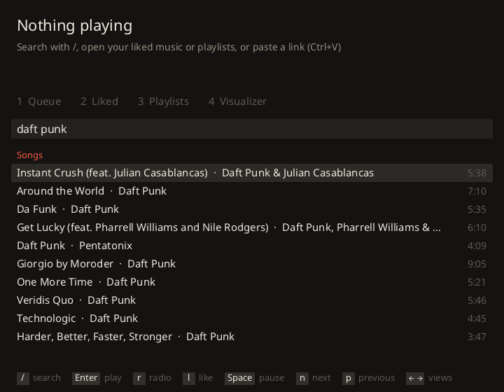
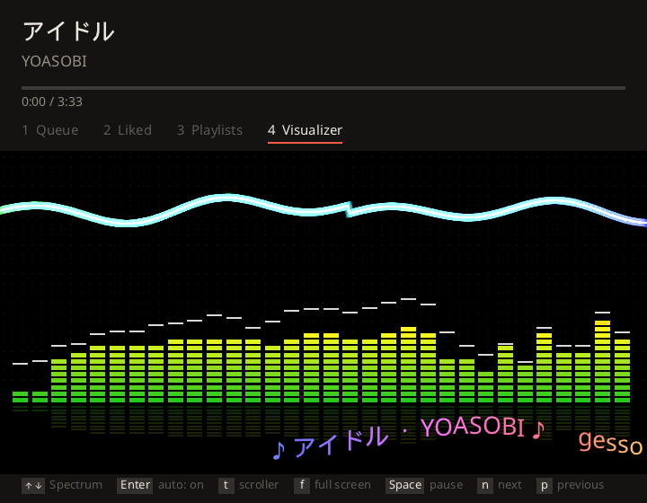

# gtube

A native YouTube Music player with a music visualizer, written in C on [gesso](https://github.com/wakamex/gesso).

 

A music player shouldn't need a copy of a web browser. Desktop players are usually web apps shipped inside Electron or a WebView, which bring a whole Chromium along. gtube is one executable of about 4 MB for Windows or Linux, a 1.8 MB download, drawing with [Simple DirectMedia Layer (SDL)](https://www.libsdl.org/) and playing [Opus](https://opus-codec.org/) audio directly. Playing a track, it uses about 90 MB of RAM on Windows with an NVIDIA GPU, and on Linux about 55 MB plus the graphics driver's share.

Search, liked music, your playlists, radio and likes come from YouTube Music's web API, the same one its website uses; [yt-dlp](https://github.com/yt-dlp/yt-dlp) streams the audio. gtube is not affiliated with Google, and a change on YouTube's side can break it until gtube catches up.

## Download or build

Download the Linux or Windows archive from [Releases](https://github.com/wakamex/gtube/releases), unpack it, and run `gtube` (or `gtube.exe`). Give it a link to start playing at once:

```sh
./gtube "https://music.youtube.com/playlist?list=..."
```

The Linux build runs on the [GNU C Library (glibc)](https://www.gnu.org/software/libc/) 2.31 or newer (Ubuntu 20.04, Debian 11, Fedora 32 and later). Each archive's `licenses` folder holds the licenses of the code compiled into it.

To build from source instead, use [Zig](https://ziglang.org) 0.16, which fetches gesso, SDL and the rest on the first build; nothing else needs installing to build it.

```sh
git clone https://github.com/wakamex/gtube
cd gtube
zig build run --release=fast
```

With a link to play: `zig build run --release=fast -- URL`. The executable lands in `zig-out/bin`. To build the Windows version, on Windows or from Linux:

```sh
zig build --release=fast -Dtarget=x86_64-windows-gnu -p zig-out/windows
```

Keep `gtube.gpu` (or `gtube.exe.gpu`) next to the executable when you move it; the visualizer's GPU effects load it from there.

On Linux gtube needs `curl` and an X11 or Wayland desktop, plus `unzip` if it has to download [Deno](https://deno.com/) (see First run). [WebKitGTK](https://webkitgtk.org/) is needed for the sign-in window (see Sign-in), and a [Vulkan](https://www.vulkan.org/) driver is optional (see Visualizer).

## First run

On first run gtube downloads its own copy of yt-dlp into its data folder and keeps it current, so the first song takes a little longer. yt-dlp needs a JavaScript runtime for YouTube: gtube uses Deno, Node or Bun if one is on your PATH, and otherwise downloads Deno too.

Signed out, search, links and radio work. Your liked music, your playlists and liking songs need you to sign in, and YouTube sometimes asks for a signed-in session before it will play a track; the status line says so when it does.

## Sign-in

Press s. It opens Google's sign-in page in a small window: [WebView2](https://developer.microsoft.com/microsoft-edge/webview2/) on Windows, WebKitGTK on Linux. Once it reaches YouTube signed in, gtube keeps only the YouTube and Google cookies, and renews the session over plain HTTPS at launch and every 10 minutes. On Windows the cookies are saved encrypted for your Windows user with the Windows Data Protection API (DPAPI); on Linux, in a file in the data folder that only your user can read.

The Linux window needs WebKitGTK 2.42 or newer, for GTK 3 or GTK 4: `webkit2gtk4.1` or `webkitgtk6.0` on Fedora, `libwebkit2gtk-4.1-0` or `libwebkitgtk-6.0-4` on Debian and Ubuntu, `webkit2gtk-4.1` or `webkitgtk-6.0` on Arch. GNOME desktops already have the GTK 4 one. Without either, import a browser's cookies instead. Sign in to music.youtube.com in a browser, export its cookies in Netscape cookies.txt format with an extension such as [Get cookies.txt LOCALLY](https://chrome.google.com/webstore/detail/get-cookiestxt-locally/cclelndahbckbenkjhflpdbgdldlbecc) for Chrome or [cookies.txt](https://addons.mozilla.org/en-US/firefox/addon/cookies-txt/) for Firefox (the ones [yt-dlp suggests](https://github.com/yt-dlp/yt-dlp/wiki/FAQ#how-do-i-pass-cookies-to-yt-dlp)), and run:

```sh
zig build run --release=fast -- --import-cookies ~/Downloads/cookies.txt
```

gtube keeps only the youtube.com and google.com cookies from the file and renews the session the same way. Delete the exported file afterwards; it holds your Google session.

## Keys

| Key | Action |
|---|---|
| 1 to 4, or Left and Right | Queue, liked music, your playlists, visualizer |
| / or Ctrl+F | Search songs, albums and playlists |
| Enter or click | Play a song and the rest of its list, or open an album or playlist |
| Esc or Backspace | Leave search, or go back from an album or playlist |
| Space | Pause or resume |
| n, p (or the media keys) | Next and previous track |
| r | Start a radio from the selected or playing song |
| l | Like or unlike the selected song |
| Ctrl+V, or drop a link | Play a link: a track, an album or a playlist |
| - and + | Volume |
| s | Sign in |
| F1 | Performance overlay |
| f, Alt+Enter or F11 | Full screen |

Long playlists load in full, not page by page. The window's size and position and the queue are kept between runs; a restored queue waits for Space or Enter, and a restored radio keeps loading more as it plays.

## Visualizer

View 4 draws what you're hearing (a 64-band spectrum, the waveform, bass, mids, treble and beats) through seven effects, at the screen's full resolution:

- Spectrum: Winamp-style LED bars with a scope
- Tunnel: a bending tunnel of textured rings
- Feedback: [MilkDrop](https://en.wikipedia.org/wiki/MilkDrop)-style, each frame the last one seen through a warp mesh
- Fire, fed by the spectrum
- Stars and bobs: a warp starfield around a sphere of bobs pushed out by the bands
- Bend plasma and Bend tree, written in [Bend](https://github.com/bendlang/bend)

| Key | Action |
|---|---|
| Up and Down | Change the effect |
| Enter | Auto mode on or off: a new effect every 40 s and with each track |
| t | Show or hide the scroller with the track's name |
| g | Run a Bend effect on the GPU or the CPU |

The two Bend effects draw every pixel on a thread of their own. With a Vulkan GPU they draw straight into the player's textures: at 4K on an RTX 3080 the plasma runs at over 3,000 frames a second with `--uncapped`. Without one they draw on the CPU. Loading the Vulkan driver the first time a Bend effect is shown brings gtube to about 125 MB of RAM on Windows with an NVIDIA GPU.

## Options

| Option | Effect |
|---|---|
| `--search QUERY`, `--radio VIDEO_ID` | Start with a search or a radio |
| `--view 1-4`, `--effect N` | Start on a view or visualizer effect |
| `--full` | Start full screen |
| `--uncapped` | No vsync or frame cap, to see how fast the visualizer can go |
| `--demo` | Fill the queue with sample titles and feed the visualizer a test signal |
| `--sign-in` | Open the sign-in window at start |
| `--sign-out`, `--refresh` | Forget the saved session, or renew it once and report |
| `--import-cookies FILE` | Sign in from a browser's cookies.txt |
| `--data DIR` | Keep the tools and session elsewhere (default: `%APPDATA%\wakamex\gesso-gtube` on Windows, `~/.local/share/wakamex/gesso-gtube` on Linux) |
| `--wav F.wav [--seconds S] URL` | Render the first track to a file |
| `--shot F.png [--at S]` | Render one frame to a file |
| `--api search\|albums\|playlists\|browse\|radio ARG` | Print one API answer |
| `--tools [--probe URL]` | Only get or update yt-dlp and its JavaScript runtime, and optionally show what yt-dlp makes of a link |
| `--stats FILE [--quit S]` | Add the performance overlay's text to a file each second, and quit after S seconds |
| `--help` | List the options |

## Troubleshooting

- "YouTube wants a signed-in session": YouTube asked for an account before playing that track. Sign in (see Sign-in) and play it again.
- A track won't play: YouTube changes often, and gtube updates yt-dlp at most once a day, at launch. `gtube --tools --probe URL` prints what yt-dlp makes of the link, with its errors.
- Liked music or playlists stay empty after signing in: `gtube --refresh` renews the session once and says whether it worked. If Google ended the session, sign in again.
- The Bend effects are slow: without a Vulkan driver they draw on the CPU. The effect says which one it is using, and g switches.

## Limits

Titles render in Latin, Cyrillic, Japanese, Chinese, Korean, Devanagari and Arabic with the system fonts, but Arabic has no joining or right-to-left order yet. First audio arrives about 4 s after a link, most of it yt-dlp's extraction. Not built yet: lyrics, cover art, seeking and editing playlists.

## Development

To work on gesso alongside gtube, build against a local checkout with `zig build --fork=../gesso`. `build.zig.zon` pins a gesso commit; `zig fetch --save=gesso git+https://github.com/wakamex/gesso#main` moves it to the latest.

The Bend effects live in `src/bend/viz.bend`. The generated C (`src/bend/viz_bend.c`) and its GPU program (`src/bend/viz.gpu`) are committed; regenerating them with `src/bend/build.sh` needs a Bend compiler with the Vulkan backend.

## License

gtube is MIT licensed (see `LICENSE`). `src/bend/viz_bend.c` and `src/bend/viz.gpu` are generated by the Bend compiler and include its runtime, which is under the Apache License 2.0 (see `src/bend/LICENSE`). The WebView2 headers in `src/vendor/webview2` keep Microsoft's license beside them.
